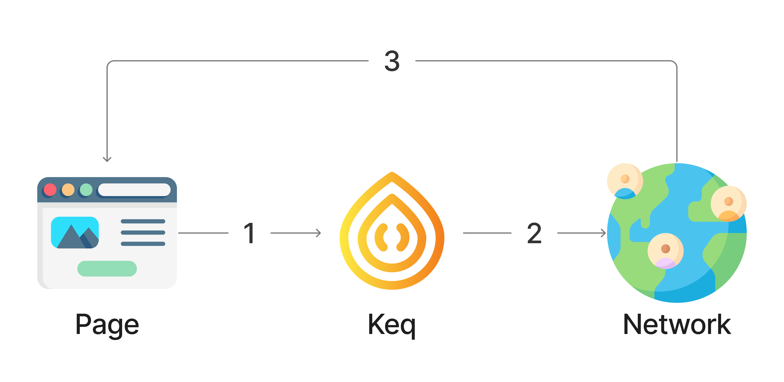
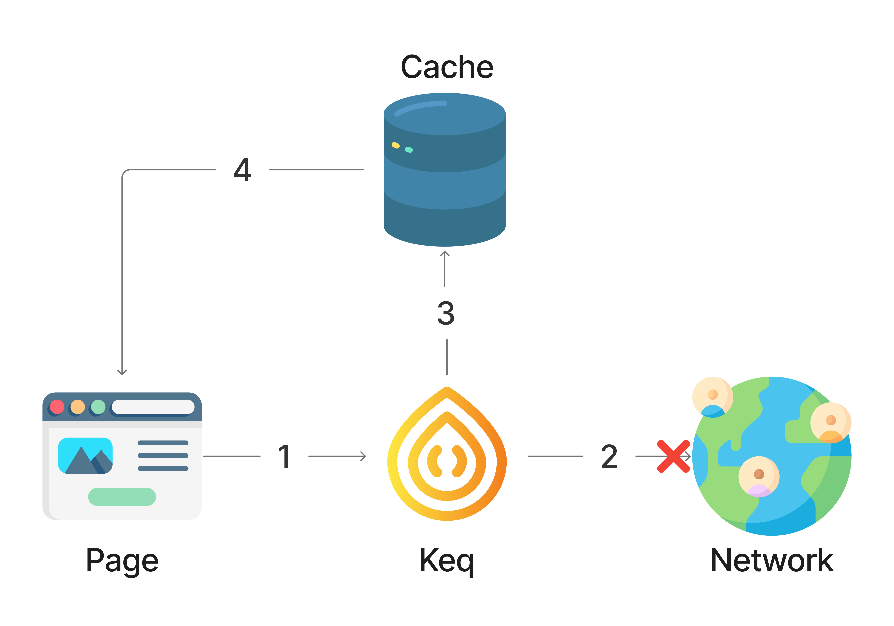
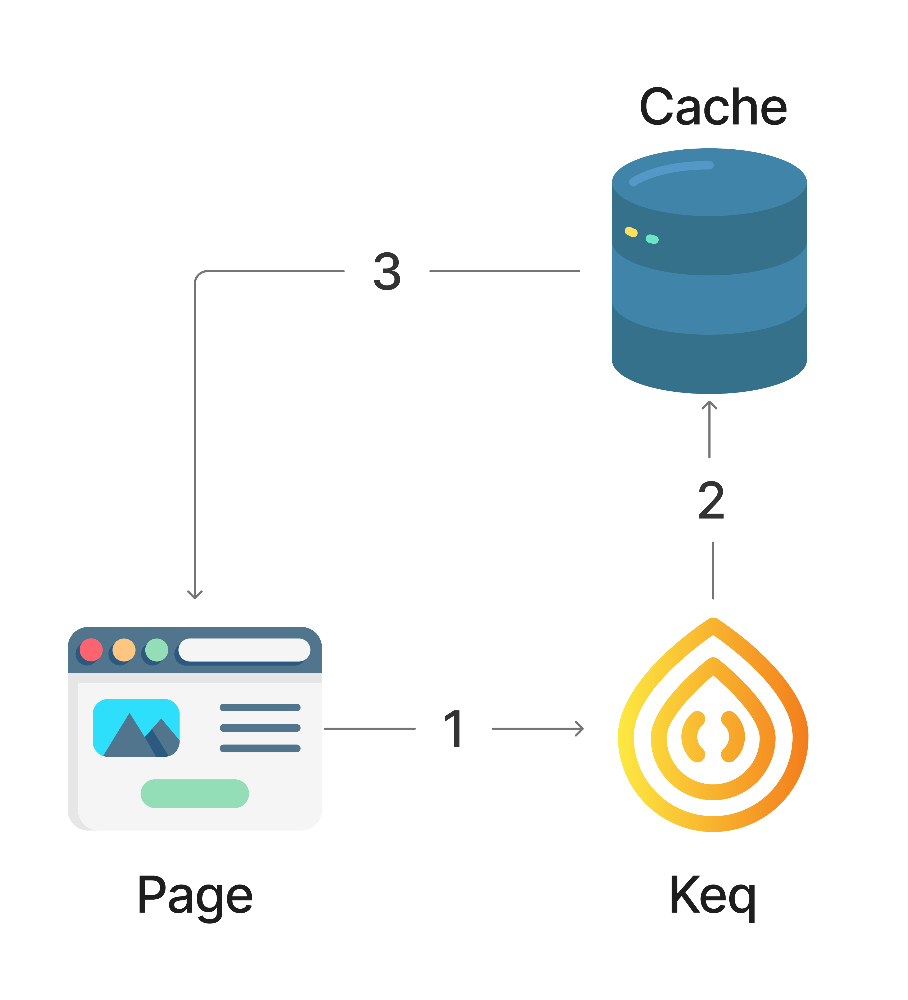
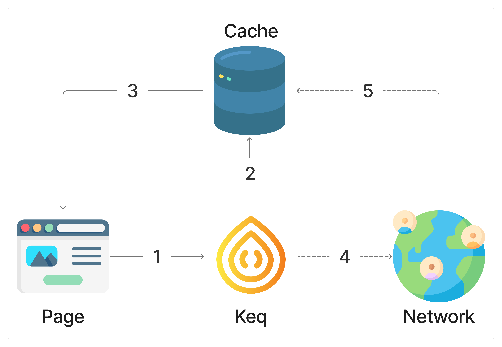

# Strategies

## `Strategies.NETWORK_ONLY`



Send request directly. Don't use cache.

## `Strategies.NETWORK_FIRST`



Try to send the request, if it fails, return the cache.

## `Strategies.CACHE_FIRST`



Return cache if it exists, otherwise send request.

## `Strategies.STALE_WHILE_REVALIDATE`


Return cache if it exists And then send request and update cache asynchronously.

## Custom

You can implement your own `Strategy` function to control cache behavior.

```typescript
import { createResponseProxy } from "keq";
import { KeqCacheStrategy } from "keq-cache";

const MyStrategy: KeqCacheStrategy = function (opt) {
  const { storage, key, onNetworkResponse } = opts;

  return async function (ctx, next) {
    const cache = await storage.get(key);

    if (cache) {
      // hit cache

      // Create a Response that can be consumed multiple time
      cacheResponseProxy = createResponseProxy(cache?.response);

      ctx.res = cache.response;
      ctx.response = cacheResponseProxy;

      // Avoid next function not called warning
      ctx.metadata.entryNextTimes = 1;
      ctx.metadata.outNextTimes = 1;

      return;
    }

    // Call `next()`, if the cache is not hit
    await next();

    if (ctx.response) {
      if (!opts.exclude || !(await opts.exclude(ctx.response))) {
        // Set cache if not excluded
        storage.set(
          await CacheEntry.build({
            key: key,
            response: ctx.response,
            expiredAt: undefined,
            ttl: opts.ttl,
          })
        );
      }

      // Run event hooks
      if (onNetworkResponse) {
        onNetworkResponse(ctx.response.clone(), cacheResponseProxy?.clone());
      }
    }
  };
};
```

Implementing a strategy is complex, and you may need to call different strategies in different scenarios:

```typescript
import { KeqCacheStrategy } from "keq-cache";

const MyStrategy: KeqCacheStrategy = function (opt) {
  if (/** condition */) {
    return Strategies.STALE_WHILE_REVALIDATE(opt)
  } else {
    return Strategies.CACHE_FIRST(opt)
  }
}
```
